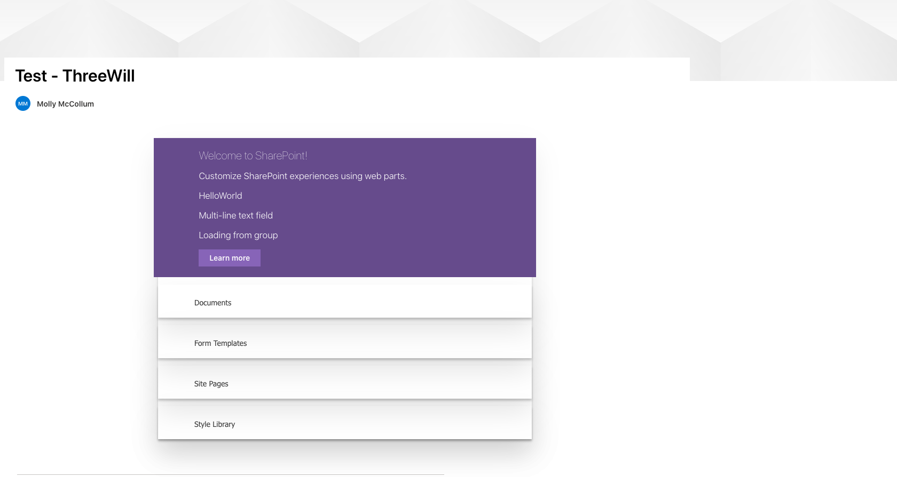

# Microsoft Webparts Intro

## Description
This is a demo of a SharePoint client-side webpart that is deployed to an online SharePoint page using the Office 365 CDN. The webpart is accessing the SharePoint REST API to render a list and list items. 

Please visit the [deployed site](https://mollym.sharepoint.com/sites/group/SitePages/Test---ThreeWill.aspx) to see the finished product.

## Technologies
* Typescript
* Node v.10
* yeoman
* Gulp
* SharePoint REST API
* CLI for Microsoft 365

## Contributing

This repository was created by Molly McCollum and is not currently accepting any contributors. 

Thank you to Microsoft Development Documentation to providing a detailed [tutorial](https://docs.microsoft.com/en-us/sharepoint/dev/spfx/web-parts/get-started/build-a-hello-world-web-part).

